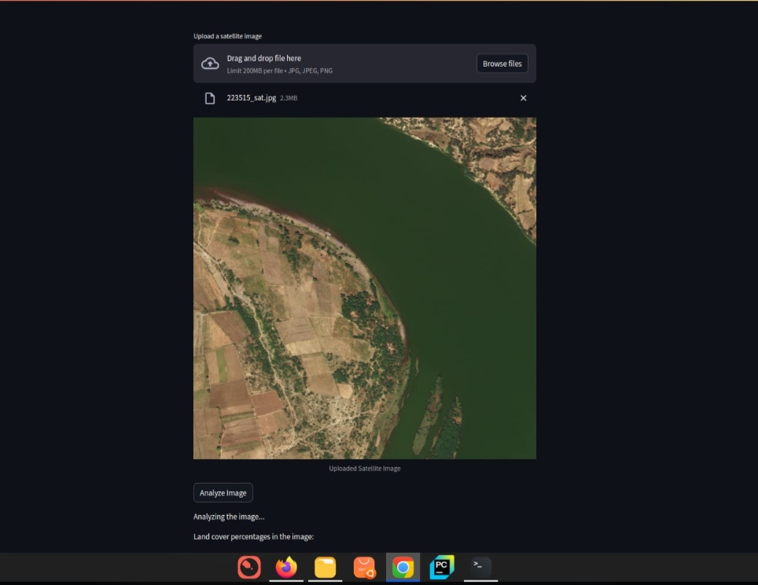
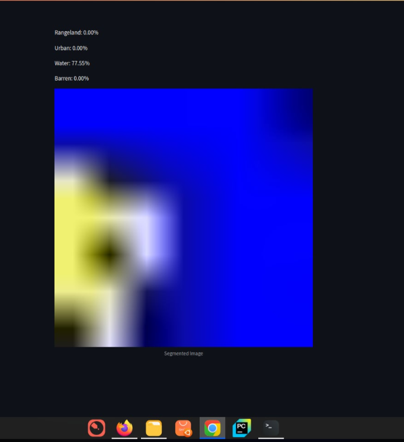
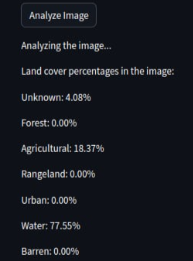

# DeepLearning_SwinTransformer
Study the Swin Transformer for remote sensing image segmentation
* The dataset(2.7GB) is pushed on Drive: 
* https://drive.google.com/drive/folders/18d-TDFIHgQMfCII54xxwP57-VaUIXkE4?usp=sharing

========================================
* 
* Developed by: Microsoft Asian Lab
*   
## Citing Swin Transformer
```
@inproceedings{liu2021Swin,
  title={Swin Transformer: Hierarchical Vision Transformer using Shifted Windows},
  author={Liu, Ze and Lin, Yutong and Cao, Yue and Hu, Han and Wei, Yixuan and Zhang, Zheng and Lin, Stephen and Guo, Baining},
  booktitle={Proceedings of the IEEE/CVF International Conference on Computer Vision (ICCV)},
  year={2021}
}
```

* Swin Transformer: Hierarchical Vision Transformer using Shifted Windows: https://arxiv.org/pdf/2103.14030
